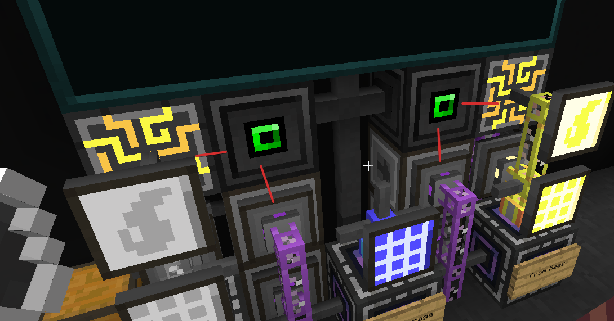
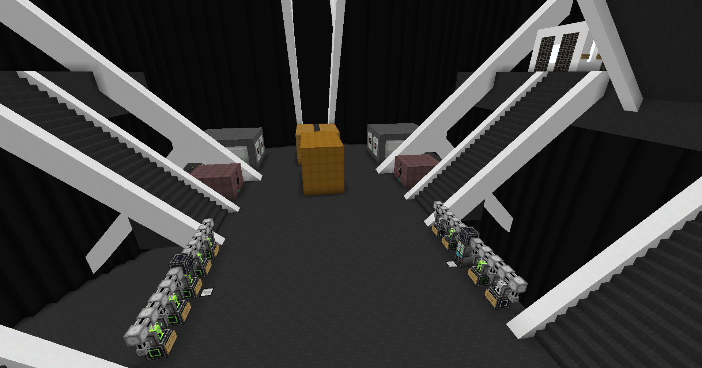
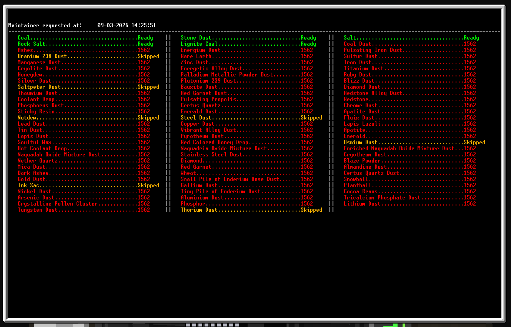
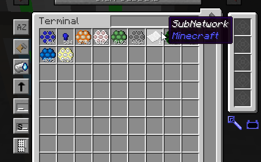

# BeeMaintainer
A funny solution for our bee setup to process combs in bulk only when item quantity is below minimum. Our processing setup tries to process the combs until dusts or wanted product. Fluids required for processing is not done by the maintainer and connected separately to our machines, WIP how we like to do this.

We using autocraft as item transfer, could not find a faster/better solution.

## Why?
We like to process periodically in bulk which will not conflict when using manually and can easily be fixed when problems occur.
With normal maintainers percentages were annoying to handle, resetting was just a hassle doing it manually.  

So I've tried to make a script to be able to handle our needs, criteria:
- Don't overflow subnetwork with combs that already running
- Manual testing/adding combs should not break anything
- Exporting items to subnetwork should be at least fast enough for at least 10K/s
- Not caring about percentage recipes
- No need to manually reset anything
  - Only if some items keeps stuck in subnetwork due power outage all cells should be cleared back into main network

## Setup
To run this setup you need the following infrastructure

- Computer with graphics card, internet card if you want to download the script
  - Download or copy the scripts to the computer and run `maintainer.lua` to start, CRTL + C to cancel.
- Adapter connected to processing ME controller
  - A paper called SubNetwork inside the network
- Adapter connected to comb storage + output items
  - Don't connect your whole storage or other autocrafts to it
- Adapter(s) connected to interface(s) where the crafting recipes are stored in
- Interface kissing to processing network, interface with pattern needs fake crafting card
- Crafting recipes patterns
  - A crafting recipe can only accept 1 input item (mostly the comb), the script can handle multiple outputs but fake crafting card doesn't seem to like it
  - A crafting recipe should always be configured to handle 1 whole cycle
    - eg. 1 rare eartch comb -> 1 rare earth (ignore percentages)
    - eg. 4 Titanium combs -> 4 Purified Titanium ore
    - wrong eg. 1 Titanium comb -> 4 Purified Titanium ore, because crafting recipe needs at least 4
    - NOTE: increase the quantity to speed up moving items, co-processors also help
- Fluid discretizer on the storage network if you want to craft fluids



## Configuration
```
--- Interval of script running in seconds
local TIMER_INTERVAL_IN_SECONDS = 600

--- Minimum quantity of items
local MINIMUM_QUANTITY = 2000000
local BATCH_SIZE = 25000

--- Minimum quantity of fluids
local FLUID_MINIMUM_QUANTITY = 4000000
local FLUID_BATCH_SIZE = 250000
```

## Features
- [X] Caches crafting recipe input/outputs & craftables
- [X] Automaticly identifies seperated networks with a paper
- [X] Shows error when same output is configured twice
- [X] Maintains a global item amount in batches & different global for fluids
- [X] Sketchy retry logic to try lower quantities of combs
- [X] Skip logic if the input is already inside the processing network
- [X] Basic AI made UI to show what finished, added last interval, failed to request
- [ ] Update the `subNetworkItems` when requesting new combs
- [ ] Make retry logic configurable with wanted quantities
  - Do retry logic internal without requesting ot AE2
- [ ] Make UI update from a table, faster visibility after the script has run
- [ ] Craftable filter to remove craftables that were not scanned by the interface adapters
  - With this you can manually start specific items without them being maintained
- [ ] Install/Update script so you can just run the script and it installs the new code
- [ ] Maybe: custom configuration for specific items

## Known bugs
- Fake crafting card doesn't cancel the request if it contains multiple outputs
  - Workaround: if a comb has multiple outcomes you want you need to pattern them separately  
- When a comb has multiple outputs it will request the combs multiple times (for each resource)

## Screenshots






